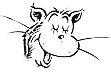
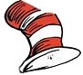

# Belge Nesne Modeli(Document Object Model)

{{quote {author: "Friedrich Nietzsche", title: "İyinin ve Kötünün Ötesinde", chapter: true}

Çok kötü! Aynı eski hikaye! Evinizi inşa etmeyi bitirdikten sonra, başlamadan önce gerçekten bilmeniz gereken bir şeyi yanlışlıkla öğrendiğinizi fark edersiniz.

quote}}

{{figure {url: "img/chapter_picture_14.jpg", alt: "Dallarında harfler, resimler ve dişliler asılı bir ağacı gösteren illüstrasyon", chapter: "framed"}}}

{{index drawing, parsing}}

Bir web sayfası açtığınızda, tarayıcınız sayfanın ((HTML)) metnini alır ve bunu, [bölüm ?](language#parsing) içindeki ayrıştırıcımızın programları ayrıştırdığı gibi ayrıştırır. Tarayıcı, belgenin ((yapısı))nın bir modelini oluşturur ve bu modeli sayfayı ekranda çizmek için kullanır.

{{index "live data structure"}}

Bu ((belgenin)) temsili, JavaScript programının ((sandbox)) içinde kullanabileceği oyuncaklardan biridir. Okuyabileceğiniz veya değiştirebileceğiniz bir ((veri yapısı))dır. Bu, _canlı_ bir veri yapısı olarak işlev görür: değiştirildiğinde, ekrandaki sayfa değişiklikleri yansıtacak şekilde güncellenir.

## Doküman yapısı

{{index [HTML, structure]}}

Bir HTML belgesini, iç içe geçmiş bir dizi ((kutu)) olarak hayal edebilirsiniz. `<body>` ve `</body>` gibi etiketler, diğer ((etiket))leri kapsar, bu etiketler de sırasıyla başka etiketler veya ((metin)) içerir. İşte [önceki bölümdeki](browser) örnek belge:

```{lang: html, sandbox: "homepage"}
<!doctype html>
<html>
  <head>
    <title>My home page</title>
  </head>
  <body>
    <h1>My home page</h1>
    <p>Hello, I am Marijn and this is my home page.</p>
    <p>I also wrote a book! Read it
      <a href="http://eloquentjavascript.net">here</a>.</p>
  </body>
</html>
```

This page has the following structure:

{{figure {url: "img/html-boxes.svg", alt: "Bir HTML belgesini iç içe geçmiş kutular kümesi olarak gösteren diyagram. Dış kutu 'html' olarak etiketlenmiştir ve 'head' ve 'body' olarak etiketlenmiş iki kutu içerir. Bunların içinde başka kutular vardır ve en içteki kutulardan bazıları belgenin metnini içerir.", width: "7cm"}}}

{{indexsee "Document Object Model", DOM}}

Tarayıcının belgeyi temsil etmek için kullandığı veri yapısı bu şekli takip eder. Her kutu için, hangi HTML etiketini temsil ettiğini ve içerdiği kutu ve metinleri öğrenmek için etkileşime girebileceğimiz bir nesne vardır. Bu temsile _Document Object Model_ veya kısaca ((DOM)) denir.

{{index "documentElement property", "head property", "body property", "html (HTML tag)", "body (HTML tag)", "head (HTML tag)"}}

Küresel `document` bağı, bu nesnelere erişim sağlar. `documentElement` özelliği, `<html>` etiketini temsil eden nesneye atıfta bulunur. Her HTML belgesinde bir baş ve bir gövde bulunduğundan, `head` ve `body` özelliklerine de sahiptir, bu öğelere işaret eder.

## Ağaçlar

{{index [nesting, "of objects"]}}

Bir an için [bölüm ?](language#parsing) ((sözdizim ağacı))na geri dönün. Yapıları, bir tarayıcının belgesinin yapısına çarpıcı biçimde benzer. Her bir _((düğüm))_, başka düğümlere, yani _çocuklar_, atıfta bulunabilir, bu da kendi çocuklarına sahip olabilir. Bu şekil, öğelerin kendilerine benzer alt öğeler içerebileceği iç içe geçmiş yapılara özgüdür.

{{index "documentElement property", [DOM, tree]}}

Bir veri yapısına, dallanma yapısına sahip olduğunda, ((döngü))süz (bir düğüm doğrudan veya dolaylı olarak kendisini içeremez) ve tek, iyi tanımlanmış bir _((kök))_ olduğunda _((ağaç))_ denir. DOM durumunda, `document.documentElement` kök olarak hizmet eder.

{{index sorting, ["data structure", "tree"], "syntax tree"}}

Ağaçlar bilgisayar biliminde sıkça karşımıza çıkar. HTML belgeleri veya programlar gibi özyinelemeli yapıları temsil etmenin yanı sıra, genellikle sıralı ((küme))ler veri tutmak için kullanılırlar çünkü ağaçlarda öğeler düz bir dizidekinden daha verimli bir şekilde bulunabilir veya eklenebilir.

{{index "leaf node", "Egg language"}}

Tipik bir ağaç, farklı türde ((düğüm))lere sahiptir. [Egg dilinin](language) sözdizim ağacında tanımlayıcılar, değerler ve uygulama düğümleri vardı. Uygulama düğümleri çocuklara sahip olabilirken, tanımlayıcılar ve değerler _yaprak düğümleri_, yani çocuksuz düğümlerdi.

{{index "body property", [HTML, structure]}}

Aynı durum DOM için de geçerlidir. HTML etiketlerini temsil eden _((öğe))_ düğümleri, belgenin yapısını belirler. Bu düğümler ((çocuk düğüm))lere sahip olabilir. Bu tür bir düğüme örnek olarak `document.body` verilebilir. Bu çocuklardan bazıları ((yaprak düğüm))ler olabilir, örneğin ((metin)) parçaları veya ((yorum)) düğümleri gibi.

{{index "text node", element, "ELEMENT_NODE code", "COMMENT_NODE code", "TEXT_NODE code", "nodeType property"}}

Her DOM düğüm nesnesinin, düğüm türünü tanımlayan bir kod (sayı) içeren bir `nodeType` özelliği vardır. Öğeler, sabit özellik `Node.ELEMENT_NODE` olarak tanımlanan 1 koduna sahiptir. Belgede bir metin bölümünü temsil eden metin düğümleri 3 kodunu (`Node.TEXT_NODE`) alır. Yorumlar 8 koduna (`Node.COMMENT_NODE`) sahiptir.

Belgemizi ((ağacı)) görselleştirmenin bir başka yolu da aşağıdaki gibidir:

{{figure {url: "img/html-tree.svg", alt: "HTML belgesini üst düğümlerden alt düğümlere giden oklarla bir ağaç olarak gösteren diyagram", width: "8cm"}}}

Yapraklar metin düğümleridir ve oklar düğümler arasındaki ebeveyn-çocuk ilişkilerini gösterir.

{{id standard}}

## Standart

{{index "programming language", [interface, design], [DOM, interface]}}

Düğüm türlerini temsil etmek için şifreli sayısal kodlar kullanmak pek JavaScript tarzı bir yaklaşım değildir. Bu bölümün ilerleyen kısımlarında, DOM arayüzünün diğer bölümlerinin de sıkıcı ve yabancı hissettirdiğini göreceğiz. Bunun nedeni, DOM arayüzünün sadece JavaScript için tasarlanmamış olmasıdır. Bunun yerine, sadece HTML için değil, aynı zamanda HTML benzeri bir söz dizimine sahip genel bir ((veri formatı)) olan ((XML)) gibi diğer sistemlerde de kullanılabilecek dil tarafsız bir arayüz olmaya çalışır.

{{index consistency, integration}}

Bu talihsiz bir durum. Standartlar genellikle yararlıdır. Ancak bu durumda, avantaj (diller arası tutarlılık) pek çekici değil. Kullandığınız dil ile düzgün bir şekilde entegre edilmiş bir arayüze sahip olmak, diller arası tanıdık bir arayüze sahip olmaktan daha fazla zaman kazandıracaktır.

{{index "array-like object", "NodeList type"}}

Bu kötü entegrasyona bir örnek olarak, DOM’daki öğe düğümlerinin sahip olduğu `childNodes` özelliğini düşünün. Bu özellik, bir `length` özelliği olan ve çocuk düğümlere erişmek için numaralarla etiketlenmiş özellikler içeren dizi benzeri bir nesne tutar. Ancak bu, gerçek bir dizi olmayan `NodeList` türünün bir örneğidir, bu yüzden `slice` ve `map` gibi metodlara sahip değildir.

{{index [interface, design], [DOM, construction], "side effect"}}

Daha sonra, basitçe kötü tasarım olan sorunlar var. Örneğin, yeni bir düğüm oluşturup hemen çocukları veya ((özellik))leri eklemenin bir yolu yoktur. Bunun yerine, önce düğümü oluşturmalı ve ardından çocukları ve özellikleri tek tek yan etkiler kullanarak eklemelisiniz. DOM ile yoğun etkileşimde bulunan kodlar genellikle uzun, tekrarlayıcı ve çirkin olur.

{{index library}}

Ancak bu kusurlar ölümcül değil. JavaScript, kendi ((soyutlama))larımızı oluşturmamıza izin verdiği için, gerçekleştirdiğiniz işlemleri ifade etmenin daha iyi yollarını tasarlamak mümkündür. Tarayıcı programlaması için tasarlanmış birçok kütüphane, bu tür araçlarla birlikte gelir.

## Ağaç içerisinden ilerlemek

{{index pointer}}

DOM düğümleri, yakındaki diğer düğümlere çok sayıda ((bağlantı)) içerir. Aşağıdaki diyagram bunları göstermektedir:

{{figure {url: "img/html-links.svg", alt: "DOM düğümleri arasındaki bağlantıları gösteren diyagram. 'body' düğümü, başlangıcındaki 'h1' düğümünü işaret eden bir 'firstChild' oku, son paragraf düğümünü işaret eden bir 'lastChild' oku ve tüm çocuklarına giden bir dizi bağlantıyı işaret eden 'childNodes' oku ile bir kutu olarak gösterilir. Ortadaki paragrafın kendisinden önceki düğümü gösteren bir 'previousSibling' oku, kendisinden sonraki düğümü gösteren bir 'nextSibling' oku ve 'body' düğümünü gösteren bir 'parentNode' oku vardır.”, width: ”6cm"}}}

{{index "child node", "parentNode property", "childNodes property"}}

Diyagram sadece her türden bir bağlantıyı gösterse de, her düğümün, eğer varsa, bir parçası olduğu düğümü işaret eden bir `parentNode` özelliği vardır. Aynı şekilde, her öğe düğümü (düğüm türü 1) çocuklarını tutan dizi benzeri bir nesneyi işaret eden bir `childNodes` özelliğine sahiptir.

{{index "firstChild property", "lastChild property", "previousSibling property", "nextSibling property"}}

Teoride, sadece bu ana ve çocuk bağlantıları kullanarak ağaçta herhangi bir yere hareket edebilirsiniz. Ancak JavaScript, size bir dizi ek kolaylık bağlantısı da sunar. `firstChild` ve `lastChild` özellikleri, ilk ve son çocuk öğeleri işaret eder veya çocuğu olmayan düğümler için `null` değerine sahiptir. Benzer şekilde, `previousSibling` ve `nextSibling`, aynı ebeveyne sahip ve düğümün hemen öncesinde veya sonrasında görünen bitişik düğümleri işaret eder. İlk çocuk için, `previousSibling` null olacaktır ve son çocuk için `nextSibling` null olacaktır.

{{index "children property", "text node", element}}

Ayrıca, `children` özelliği de vardır, bu `childNodes` gibidir ancak sadece öğe (tür 1) çocukları içerir, diğer türde çocuk düğümleri içermez. Bu, metin düğümleriyle ilgilenmediğinizde yararlı olabilir.

{{index "talksAbout function", recursion, [nesting, "of objects"]}}

Bu tür iç içe geçmiş bir veri yapısı ile çalışırken, özyinelemeli fonksiyonlar genellikle faydalıdır. Aşağıdaki fonksiyon, bir belgeyi belirli bir dizeyi içeren ((metin düğümü))ler için tarar ve birini bulduğunda `true` döndürür:

{{id talksAbout}}

```{sandbox: "homepage"}
function talksAbout(node, string) {
  if (node.nodeType == Node.ELEMENT_NODE) {
    for (let child of node.childNodes) {
      if (talksAbout(child, string)) {
        return true;
      }
    }
    return false;
  } else if (node.nodeType == Node.TEXT_NODE) {
    return node.nodeValue.indexOf(string) > -1;
  }
}

console.log(talksAbout(document.body, "book"));
// → true
```

{{index "nodeValue property"}}

Bir metin düğümünün `nodeValue` özelliği, temsil ettiği metin dizesini tutar.

## Finding elements

{{index [DOM, querying], "body property", "hard-coding", [whitespace, "in HTML"]}}

Bu ((link))leri ebeveynler, çocuklar ve kardeşler arasında gezdirmek genellikle yararlıdır. Ancak belgede belirli bir düğümü bulmak istiyorsak, `document.body` adresinden başlayıp sabit bir özellik yolunu izleyerek ona ulaşmak kötü bir fikirdir. Bunu yapmak, programımıza belgenin kesin yapısı hakkında varsayımlar ekler - daha sonra değiştirmek isteyebileceğiniz bir yapı. Bir başka karmaşık faktör de metin düğümlerinin düğümler arasındaki boşluklar için bile oluşturulmasıdır. Örnek belgenin `<body>` etiketinin sadece üç alt öğesi (`<h1>` ve iki `<p>` öğesi) değil, aslında yedi alt öğesi vardır: bu üç öğe, artı onlardan önceki, sonraki ve aralarındaki boşluklar.

{{index "search problem", "href attribute", "getElementsByTagName method"}}

Dolayısıyla, o belgedeki bağlantının `href` niteliğini almak istiyorsak, “Belge gövdesinin altıncı çocuğunun ikinci çocuğunu al” gibi bir şey söylemek istemeyiz. “Belgedeki ilk bağlantıyı al” diyebilseydik daha iyi olurdu. Öyle de yapabiliriz.

```{sandbox: "homepage"}
let link = document.body.getElementsByTagName("a")[0];
console.log(link.href);
```

{{index "child node"}}

Tüm öğe düğümleri, verilen etiket adına sahip olan ve bu düğümün torunları (doğrudan veya dolaylı çocukları) olan tüm öğeleri toplayan ve bunları bir ((dizi benzeri nesne)) olarak döndüren bir `getElementsByTagName` yöntemine sahiptir.

{{index "id attribute", "getElementById method"}}

Belirli bir _single_ düğümü bulmak için, ona bir `id` niteliği verebilir ve bunun yerine `document.getElementById` kullanabilirsiniz.

```{lang: html}
<p>My ostrich Gertrude:</p>
<p></p>

<script>
  let ostrich = document.getElementById("gertrude");
  console.log(ostrich.src);
</script>
```

{{index "getElementsByClassName method", "class attribute"}}

Üçüncü ve benzer bir yöntem olan `getElementsByClassName`, `getElementsByTagName` gibi, bir öğe düğümünün içeriğini arar ve `class` niteliğinde verilen dizeye sahip tüm öğeleri alır.

## Dokümanı değiştirmek

{{index "side effect", "removeChild method", "appendChild method", "insertBefore method", [DOM, construction], [DOM, modification]}}

DOM veri yapısıyla ilgili neredeyse her şey değiştirilebilir. Belge ağacının şekli, ebeveyn-çocuk ilişkileri değiştirilerek değiştirilebilir. Düğümler, onları mevcut ebeveyn düğümlerinden kaldırmak için bir `remove` yöntemine sahiptir. Bir eleman düğümüne bir çocuk düğüm eklemek için, onu çocuk listesinin sonuna koyan `appendChild` veya ilk argüman olarak verilen düğümü ikinci argüman olarak verilen düğümden önce ekleyen `insertBefore` kullanabiliriz.

```{lang: html}
<p>One</p>
<p>Two</p>
<p>Three</p>

<script>
  let paragraphs = document.body.getElementsByTagName("p");
  document.body.insertBefore(paragraphs[2], paragraphs[0]);
</script>
```

Bir düğüm belgede yalnızca tek bir yerde bulunabilir. Bu nedenle, _Three_ paragrafını _One_ paragrafının önüne eklemek, önce onu belgenin sonundan kaldıracak ve sonra öne ekleyecek ve _Three_/_One_/_Two_ ile sonuçlanacaktır. Bir düğümü bir yere ekleyen tüm işlemler, ((yan etki)) olarak, mevcut konumundan (eğer varsa) kaldırılmasına neden olacaktır.

{{index "insertBefore method", "replaceChild method"}}

Bir alt düğümü başka bir düğümle değiştirmek için `replaceChild` yöntemi kullanılır. Argüman olarak iki düğüm alır: yeni bir düğüm ve değiştirilecek düğüm. Değiştirilen düğüm, yöntemin çağrıldığı öğenin bir çocuğu olmalıdır. Hem `replaceChild` hem de `insertBefore` yöntemlerinin ilk argüman olarak _new_ düğümünü beklediğini unutmayın.

## Düğümler oluşturmak

{{index "alt attribute", "img (HTML tag)", "createTextNode method"}}

Belgedeki tüm ((image))leri (`` etiketleri), `alt` niteliklerinde tutulan ve görüntünün alternatif bir metinsel temsilini belirten metinle değiştiren bir kod yazmak istediğimizi varsayalım.

{{index "createTextNode method"}}

Bu sadece resimleri kaldırmayı değil, aynı zamanda onların yerine yeni bir metin düğümü eklemeyi de içerir.

```{lang: html}
<p>The  in the
  .</p>

<p><button onclick="replaceImages()">Replace</button></p>

<script>
  function replaceImages() {
    let images = document.body.getElementsByTagName("img");
    for (let i = images.length - 1; i >= 0; i--) {
      let image = images[i];
      if (image.alt) {
        let text = document.createTextNode(image.alt);
        image.parentNode.replaceChild(text, image);
      }
    }
  }
</script>
```

{{index "text node"}}

Bir dize verildiğinde, `createTextNode` bize ekranda görünmesini sağlamak için belgeye ekleyebileceğimiz bir metin düğümü verir.

{{index "live data structure", "getElementsByTagName method", "childNodes property"}}

Görüntülerin üzerinden geçen döngü listenin sonundan başlar. Bu gereklidir çünkü `getElementsByTagName` gibi bir yöntem (ya da `childNodes` gibi bir özellik) tarafından döndürülen düğüm listesi _canlıdır_. Yani, belge değiştikçe güncellenir. Eğer en baştan başlasaydık, ilk resmi kaldırmak listenin ilk elemanını kaybetmesine neden olurdu, böylece `i`nin 1 olduğu döngü ikinci kez tekrarlandığında, koleksiyonun uzunluğu artık 1 olduğu için dururdu.

{{index "slice method"}}

Canlı bir koleksiyon yerine _solid_ bir düğüm koleksiyonu istiyorsanız, `Array.from` komutunu çağırarak koleksiyonu gerçek bir diziye dönüştürebilirsiniz.

```
let arrayish = {0: "one", 1: "two", length: 2};
let array = Array.from(arrayish);
console.log(array.map(s => s.toUpperCase()));
// → ["ONE", "TWO"]
```

{{index "createElement method"}}

((eleman)) düğümleri oluşturmak için `document.createElement` yöntemini kullanabilirsiniz. Bu yöntem bir etiket adı alır ve verilen türde yeni bir boş düğüm döndürür.

{{index "Popper, Karl", [DOM, construction], "elt function"}}

{{id elt}}

Aşağıdaki örnek, bir element düğümü oluşturan ve argümanlarının geri kalanını bu düğümün çocukları olarak ele alan bir `elt` yardımcı programı tanımlar. Bu fonksiyon daha sonra bir alıntıya atıf eklemek için kullanılır.

```{lang: html}
<blockquote id="quote">
  No book can ever be finished. While working on it we learn
  just enough to find it immature the moment we turn away
  from it.
</blockquote>

<script>
  function elt(type, ...children) {
    let node = document.createElement(type);
    for (let child of children) {
      if (typeof child != "string") node.appendChild(child);
      else node.appendChild(document.createTextNode(child));
    }
    return node;
  }

  document.getElementById("quote").appendChild(
    elt("footer", "—",
        elt("strong", "Karl Popper"),
        ", preface to the second edition of ",
        elt("em", "The Open Society and Its Enemies"),
        ", 1950"));
</script>
```

{{if book

Ortaya çıkan belge bu şekilde görünür:

{{figure {url: "img/blockquote.png", alt: "Blok alıntının atıfla birlikte işlenmiş resmi", width: "8cm"}}}

if}}

## Özellikler

{{index "href attribute", [DOM, attributes]}}

Bazı öğe ((özellik))leri, bağlantılar için `href` gibi, öğenin ((DOM)) nesnesindeki aynı isimli bir özellik aracılığıyla erişilebilir. Bu, çoğu yaygın olarak kullanılan standart özellikler için geçerlidir.

{{index "data attribute", "getAttribute method", "setAttribute method", attribute}}

Ancak HTML, düğümler üzerinde istediğiniz herhangi bir özelliği ayarlamanıza izin verir. Bu, bir belgede ek bilgi saklamanızı sağladığı için kullanışlı olabilir. Kendi özellik adlarınızı oluşturduğunuzda, bu tür özellikler öğenin düğümünde özellik olarak bulunmaz. Bunun yerine, onlarla çalışmak için `getAttribute` ve `setAttribute` metodlarını kullanmanız gerekir.

```{lang: html}
<p data-classified="secret">The launch code is 00000000.</p>
<p data-classified="unclassified">I have two feet.</p>

<script>
  let paras = document.body.getElementsByTagName("p");
  for (let para of Array.from(paras)) {
    if (para.getAttribute("data-classified") == "secret") {
      para.remove();
    }
  }
</script>
```

Bu tür oluşturulan özellik adlarının diğer özelliklerle çakışmamasını sağlamak için bu adlara `data-` öneki eklemeniz önerilir.

{{index "getAttribute method", "setAttribute method", "className property", "class attribute"}}

JavaScript dilinde bir ((anahtar kelime)) olan `class` adında yaygın olarak kullanılan bir özellik vardır. Tarihsel nedenlerden dolayı—bazı eski JavaScript uygulamaları anahtar kelimelerle eşleşen özellik adlarını işleyemiyordu—bu özelliğe erişmek için kullanılan özellik `className` olarak adlandırılır. Ayrıca, `getAttribute` ve `setAttribute` metodlarını kullanarak, gerçek adı olan `"class"` altında da erişebilirsiniz.

## Düzen

{{index layout, "block element", "inline element", "p (HTML tag)", "h1 (HTML tag)", "a (HTML tag)", "strong (HTML tag)"}}

Farklı türdeki öğelerin farklı şekillerde yerleştirildiğini fark etmiş olabilirsiniz. Paragraflar (`<p>`) veya başlıklar (`<h1>`) gibi bazıları belgenin tüm genişliğini kaplar ve ayrı satırlarda görüntülenir. Bunlara block öğeler denir. Diğerleri, bağlantılar (`<a>`) veya `<strong>` öğesi gibi, çevreleyen metinle aynı satırda görüntülenir. Bu tür öğelere _inline_ öğeler denir.

{{index drawing}}

Herhangi bir belge için, tarayıcılar her öğeye, türüne ve içeriğine göre bir boyut ve konum veren bir düzen hesaplayabilir. Bu düzen daha sonra belgeyi çizmek için kullanılır.

{{index "border (CSS)", "offsetWidth property", "offsetHeight property", "clientWidth property", "clientHeight property", dimensions}}

Bir öğenin boyutu ve konumu JavaScript’ten erişilebilir. `offsetWidth` ve `offsetHeight` özellikleri, öğenin kapladığı alanı _((piksel))_ olarak verir. Bir piksel, tarayıcıda temel ölçü birimidir. Geleneksel olarak, ekranın çizebileceği en küçük nokta ile eşleşir, ancak modern ekranlarda, _çok_ küçük noktalar çizebildiği için bu durum geçerli olmayabilir ve bir tarayıcı pikseli birden fazla ekran noktasını kapsayabilir.

Benzer şekilde, `clientWidth` ve `clientHeight` özellikleri, kenarlık genişliğini görmezden gelerek öğenin _içindeki_ alanın boyutunu verir.

```{lang: html}
<p style="border: 3px solid red">
  I'm boxed in
</p>

<script>
  let para = document.body.getElementsByTagName("p")[0];
  console.log("clientHeight:", para.clientHeight);
  // → 19
  console.log("offsetHeight:", para.offsetHeight);
  // → 25
</script>
```

{{if book

Bir paragrafa kenarlık eklemek, etrafında bir dikdörtgen çizilmesine neden olur.

{{figure {url: "img/boxed-in.png", alt: "Kenarlıklı bir paragrafın çizilmiş resmi", width: "8cm"}}}

if}}

{{index "getBoundingClientRect method", position, "pageXOffset property", "pageYOffset property"}}

{{id boundingRect}}

Bir öğenin ekrandaki kesin konumunu bulmanın en etkili yolu `getBoundingClientRect` metodudur. Bu metot, öğenin kenarlarının ekranın sol üst köşesine göre piksel konumlarını belirten `top`, `bottom`, `left` ve `right` özelliklerine sahip bir nesne döndürür. Bu konumları tüm belgeye göre almak isterseniz, mevcut kaydırma pozisyonunu eklemeniz gerekir; bu pozisyonu `pageXOffset` ve `pageYOffset` bağlamlarında bulabilirsiniz.

{{index "offsetHeight property", "getBoundingClientRect method", drawing, laziness, performance, efficiency}}

Bir belgenin düzenini oluşturmak oldukça zahmetli bir iş olabilir. Hız açısından, tarayıcı motorları, bir belgeyi her değiştirdiğinizde hemen yeniden düzenlemez, olabildiğince bekler. Belgeyi değiştiren bir JavaScript programı çalışmayı bitirdiğinde, tarayıcı değiştirilmiş belgeyi ekrana çizmek için yeni bir düzen hesaplamak zorunda kalır. Bir program `offsetHeight` gibi özellikleri okuyarak veya `getBoundingClientRect` çağırarak bir şeyin konumunu veya boyutunu sorduğunda, doğru bilgi sağlamak da bir ((layout)) hesaplamayı gerektirir.

{{index "side effect", optimization, benchmark}}

DOM düzen bilgilerini okuma ve DOM’u değiştirme arasında sürekli gidip gelen bir program, çok sayıda düzen hesaplaması yapılmasına zorlar ve bu nedenle çok yavaş çalışır. Aşağıdaki kod bunun bir örneğidir. 2.000 piksel genişliğinde _X_ karakterlerinden oluşan bir satır oluşturan ve her birinin ne kadar sürdüğünü ölçen iki farklı program içerir.

```{lang: html, test: nonumbers}
<p><span id="one"></span></p>
<p><span id="two"></span></p>

<script>
  function time(name, action) {
    let start = Date.now(); // Current time in milliseconds
    action();
    console.log(name, "took", Date.now() - start, "ms");
  }

  time("naive", () => {
    let target = document.getElementById("one");
    while (target.offsetWidth < 2000) {
      target.appendChild(document.createTextNode("X"));
    }
  });
  // → naive took 32 ms

  time("clever", function() {
    let target = document.getElementById("two");
    target.appendChild(document.createTextNode("XXXXX"));
    let total = Math.ceil(2000 / (target.offsetWidth / 5));
    target.firstChild.nodeValue = "X".repeat(total);
  });
  // → clever took 1 ms
</script>
```

## Stillendirme

{{index "block element", "inline element", style, "strong (HTML tag)", "a (HTML tag)", underline}}

Farklı HTML öğelerinin farklı şekilde çizildiğini gördük. Bazıları blok olarak, bazıları satır içi olarak görüntülenir. Bazıları stil ekler—`<strong>`, içeriğini ((kalın)) yapar ve `<a>`, içeriğini mavi yapar ve altını çizer.

{{index "img (HTML tag)", "default behavior", "style attribute"}}

Bir `` etiketinin bir görüntüyü nasıl gösterdiği veya bir `<a>` etiketinin üzerine tıklandığında bir bağlantının nasıl takip edileceği, öğe türüyle güçlü bir şekilde ilişkilidir. Ancak bir öğe ile ilişkilendirilen stili, örneğin metin rengi veya alt çizgi gibi, değiştirebiliriz. İşte `style` özelliğini kullanan bir örnek:

```{lang: html}
<p><a href=".">Normal link</a></p>
<p><a href="." style="color: green">Green link</a></p>
```

{{if book

İkinci bağlantı, varsayılan bağlantı renginin yerine yeşil olacak.

{{figure {url: "img/colored-links.png", alt: "Normal mavi bağlantı ve stil verilmiş yeşil bağlantının çizilmiş resmi", width: "2.2cm"}}}

if}}

{{index "border (CSS)", "color (CSS)", CSS, "colon character"}}

Bir stil niteliği bir veya daha fazla _((declaration))s_ içerebilir; bunlar bir özellik (örneğin `color`), ardından iki nokta üst üste ve bir değerdir (örneğin `green`). Birden fazla bildirim olduğunda, `“color: red; border: none”` gibi ((noktalı virgül))ler ile ayrılmalıdırlar.

{{index "display (CSS)", layout}}

Bir stil niteliği bir veya daha fazla _((declaration))s_ içerebilir; bunlar bir özellik (örneğin `color`), ardından iki nokta üst üste ve bir değerdir (örneğin `green`). Birden fazla bildirim olduğunda, `“color: red; border: none”` gibi ((noktalı virgül))ler ile ayrılmalıdırlar.

```{lang: html}
This text is displayed <strong>inline</strong>,
<strong style="display: block">as a block</strong>, and
<strong style="display: none">not at all</strong>.
```

{{index "hidden element"}}

((Blok öğesi))ler etraflarındaki metinle birlikte satır içinde görüntülenmediğinden `block` etiketi kendi satırında sonlanacaktır. Son etiket hiç görüntülenmez-`display: none` bir öğenin ekranda görünmesini engeller. Bu, öğeleri gizlemenin bir yoludur. Genellikle belgeden tamamen kaldırmaya tercih edilir çünkü daha sonra tekrar ortaya çıkarmayı kolaylaştırır.

{{if book

{{figure {url: "img/display.png", alt: "Farklı ekran stilleri", width: "4cm"}}}

if}}

{{index "color (CSS)", "style attribute"}}

JavaScript kodu, bir öğenin stilini, öğenin `style` özelliği aracılığıyla doğrudan değiştirebilir. Bu özellik, tüm olası stil özellikleri için özelliklere sahip bir nesne tutar. Bu özelliklerin değerleri, öğenin stilinin belirli bir yönünü değiştirmek için yazabileceğimiz dizelerdir.

```{lang: html}
<p id="para" style="color: purple">
  Nice text
</p>

<script>
  let para = document.getElementById("para");
  console.log(para.style.color);
  para.style.color = "magenta";
</script>
```

{{index "camel case", capitalization, "hyphen character", "font-family (CSS)"}}

Bazı stil özellik adları `font-family` gibi kısa çizgiler içerir. Bu tür özellik adlarıyla JavaScript'te çalışmak zor olduğundan (`style[“font-family”]` demeniz gerekir), bu tür özellikler için `style` nesnesindeki özellik adlarının tire işaretleri kaldırılır ve kendilerinden sonraki harfler büyük yazılır (`style.fontFamily`).

## Basamaklı stiller

{{index "rule (CSS)", "style (HTML tag)"}}

{{indexsee "Cascading Style Sheets", CSS}}
{{indexsee "style sheet", CSS}}

HTML için biçimlendirme sistemi, _COPYascading Style Sheets_ için ((CSS)) olarak adlandırılır. Bir _style sheet_, bir belgedeki öğelerin nasıl biçimlendirileceğine ilişkin bir dizi kuraldır. Bir `<style>` etiketi içinde verilebilir.

```{lang: html}
<style>
  strong {
    font-style: italic;
    color: gray;
  }
</style>
<p>Now <strong>strong text</strong> is italic and gray.</p>
```

{{index "rule (CSS)", "font-weight (CSS)", overlay}}

İsimdeki _((cascading))_ kısmı, bir öğenin nihai stilini oluşturmak için birden fazla kuralın birleştirildiği gerçeğine atıfta bulunur. Örnekte, `<strong>` etiketleri için varsayılan stil olan `font-weight: bold`, `font-style` ve `color` ekleyen `<style>` etiketindeki kuralla birleşir.

{{index "style (HTML tag)", "style attribute"}}

Birden fazla kural aynı özellik için bir değer tanımladığında, en son okunan kural daha yüksek bir ((öncelik)) kazanır ve galip gelir. Dolayısıyla, `<style>` etiketindeki kural `font-weight: normal` içeriyorsa ve bu, varsayılan `font-weight` kuralıyla çelişiyorsa, metin normal olur, kalın değil. Doğrudan düğüme uygulanan bir `style` özelliğindeki stiller en yüksek önceliğe sahiptir ve her zaman kazanır.

{{index uniqueness, "class attribute", "id attribute"}}

CSS kurallarında ((etiket)) adları dışında başka şeyleri hedeflemek de mümkündür. `.abc` için bir kural, `class` özelliğinde `"abc"` bulunan tüm öğelere uygulanır. `#xyz` için bir kural ise `id` özelliği `"xyz"` olan öğeye uygulanır (bu özellik belge içinde benzersiz olmalıdır).

```{lang: "css"}
.subtle {
  color: gray;
  font-size: 80%;
}
#header {
  background: blue;
  color: white;
}
/* p elements with id main and with classes a and b */
p#main.a.b {
  margin-bottom: 20px;
}
```

{{index "rule (CSS)"}}

En son tanımlanan kuralı tercih eden _((öncelik))_ kuralı, yalnızca kuralların aynı _((özgüllük))_ seviyesine sahip olması durumunda geçerlidir. Bir kuralın özgüllüğü, eşleşen öğeleri ne kadar kesin olarak tanımladığının bir ölçüsüdür ve gerektirdiği öğe özelliklerinin (etiket, sınıf veya ID) sayısı ve türüyle belirlenir. Örneğin, `p.a` hedefleyen bir kural, `p` veya sadece `.a` hedefleyen kurallardan daha özgül olduğu için onlardan öncelikli olur.

{{index "direct child node"}}

`p > a {…}` notasyonu, belirtilen stilleri `<p>` etiketlerinin doğrudan çocukları olan tüm `<a>` etiketlerine uygular. Benzer şekilde, `p a {…}`, doğrudan veya dolaylı çocuk olup olmadığına bakılmaksızın, `<p>` etiketlerinin içindeki tüm `<a>` etiketlerine uygulanır.

## Sorgu seçicileri

{{index complexity, CSS, "domain-specific language", [DOM, querying]}}

Bu kitapta stil sayfalarını çok fazla kullanmayacağız. Tarayıcıda programlama yaparken bunları anlamak yararlıdır, ancak ayrı bir kitap gerektirecek kadar karmaşıktırlar.

{{index "domain-specific language", [DOM, querying]}}

Stil sayfalarında bir stil kümesinin hangi öğelere uygulanacağını belirlemek için kullanılan _((selector))_ sözdizimini tanıtmamın ana nedeni, aynı mini dili DOM öğelerini bulmak için etkili bir yol olarak kullanabilmemizdir.

{{index "querySelectorAll method", "NodeList type"}}

Hem `document` nesnesi hem de öğe düğümleri üzerinde tanımlanan `querySelectorAll` yöntemi, bir seçici dizesi alır ve eşleştiği tüm öğeleri içeren bir `NodeList` döndürür.

```{lang: html}
<p>And if you go chasing
  <span class="animal">rabbits</span></p>
<p>And you know you're going to fall</p>
<p>Tell 'em a <span class="character">hookah smoking
  <span class="animal">caterpillar</span></span></p>
<p>Has given you the call</p>

<script>
  function count(selector) {
    return document.querySelectorAll(selector).length;
  }
  console.log(count("p"));           // All <p> elements
  // → 4
  console.log(count(".animal"));     // Class animal
  // → 2
  console.log(count("p .animal"));   // Animal inside of <p>
  // → 2
  console.log(count("p > .animal")); // Direct child of <p>
  // → 1
</script>
```

{{index "live data structure"}}

`getElementsByTagName` gibi yöntemlerin aksine, `querySelectorAll` tarafından döndürülen nesne _canlı_ değildir. Belgeyi değiştirdiğinizde değişmez. Yine de gerçek bir dizi değildir, bu nedenle bir dizi gibi davranmak istiyorsanız `Array.from` öğesini çağırmanız gerekir.

{{index "querySelector method"}}

`querySelector` yöntemi (`All` kısmı olmadan) benzer şekilde çalışır. Bu, belirli, tek bir öğe istiyorsanız kullanışlıdır. Yalnızca ilk eşleşen öğeyi veya hiçbir öğe eşleşmediğinde null döndürür.

{{id animation}}

## Konumlandırma ve canlandırma

{{index "position (CSS)", "relative positioning", "top (CSS)", "left (CSS)", "absolute positioning"}}

`position` stil özelliği düzeni güçlü bir şekilde etkiler. Varsayılan olarak `static` değerine sahiptir, yani öğe belgedeki normal yerine oturur. `relative` olarak ayarlandığında, öğe belgede hala yer kaplar, ancak artık `top` ve `left` stil özellikleri onu bu normal yere göre hareket ettirmek için kullanılabilir. `position` öğesi `absolute` olarak ayarlandığında, öğe normal belge akışından çıkarılır; yani artık yer kaplamaz ve diğer öğelerle çakışabilir. Ayrıca, `top` ve `left` özellikleri, `position` özelliği `static` olmayan en yakın çevreleyen öğenin sol üst köşesine göre veya böyle bir çevreleyen öğe yoksa belgeye göre kesinlikle konumlandırmak için kullanılabilir.

{{index [animation, "spinning cat"]}}

Bunu bir animasyon oluşturmak için kullanabiliriz. Aşağıdaki belge, bir ((elips)) içinde hareket eden bir kedi resmi görüntüler:

```{lang: html, startCode: true}
<p style="text-align: center">
  
</p>
<script>
  let cat = document.querySelector("img");
  let angle = Math.PI / 2;
  function animate(time, lastTime) {
    if (lastTime != null) {
      angle += (time - lastTime) * 0.001;
    }
    cat.style.top = (Math.sin(angle) * 20) + "px";
    cat.style.left = (Math.cos(angle) * 200) + "px";
    requestAnimationFrame(newTime => animate(newTime, time));
  }
  requestAnimationFrame(animate);
</script>
```

{{if book

Gri ok, görüntünün hareket ettiği yolu gösterir.

{{figure {url: "img/cat-animation.png", alt: "Hareketini gösteren dairesel bir ok ile bir kedi resmini gösteren bir diyagram", width: "8cm"}}}

if}}

{{index "top (CSS)", "left (CSS)", centering, "relative positioning"}}

Resmimiz sayfada ortalanır ve `konum` değeri `göreceli` olarak verilir. Bu resmi taşımak için resmin `top` ve `left` stillerini tekrar tekrar güncelleyeceğiz.

{{index "requestAnimationFrame function", drawing, animation}}

{{id animationFrame}}

Kod, `animate` fonksiyonunu tarayıcı ekranı yeniden boyamaya hazır olduğunda çalışacak şekilde zamanlamak için `requestAnimationFrame` kullanır. Bir sonraki güncellemeyi zamanlamak için `animate` fonksiyonunun kendisi yine `requestAnimationFrame` fonksiyonunu çağırır. Tarayıcı penceresi (veya sekmesi) aktif olduğunda, bu, güncellemelerin saniyede yaklaşık 60 oranında gerçekleşmesine neden olur ve bu da iyi görünümlü bir animasyon üretme eğilimindedir.

{{index timeline, blocking}}

Eğer DOM'u bir döngü içinde güncelleseydik, sayfa donacak ve ekranda hiçbir şey görünmeyecekti. Tarayıcılar, bir JavaScript programı çalışırken ekranlarını güncellemezler ve sayfayla herhangi bir etkileşime izin vermezler. İşte bu yüzden `requestAnimationFrame`e ihtiyacımız var - tarayıcıya şimdilik işimizin bittiğini bildirir ve tarayıcıların yaptığı, ekranı güncellemek ve kullanıcı eylemlerine yanıt vermek gibi şeyleri yapmaya devam edebilir.

{{index "smooth animation"}}

Animasyon fonksiyonuna argüman olarak mevcut ((zaman)) aktarılır. Kedinin milisaniye başına hareketinin sabit olmasını sağlamak için, açının değişme hızını geçerli zaman ile fonksiyonun son çalıştığı zaman arasındaki farka dayandırır. Açıyı adım başına sabit bir miktarda hareket ettirseydi, örneğin aynı bilgisayarda çalışan başka bir ağır görev, işlevin saniyenin bir kısmı boyunca çalışmasını engellerse hareket takılırdı.

{{index "Math.cos function", "Math.sin function", cosine, sine, trigonometry}}

{{id sin_cos}}

((Daire))lerde hareket etmek `Math.cos` ve `Math.sin` trigonometri fonksiyonları kullanılarak yapılır. Bunlara aşina olmayanlar için, bu kitapta zaman zaman kullanacağımız için kısaca tanıtacağım.

{{index coordinates, pi}}

`Math.cos` ve `Math.sin` yarıçapı bir olan (0,0) noktası etrafındaki bir çember üzerinde yer alan noktaları bulmak için kullanışlıdır. Her iki fonksiyon da argümanlarını bu daire üzerindeki konum olarak yorumlar, sıfır dairenin en sağındaki noktayı gösterir ve 2π (yaklaşık 6.28) bizi tüm dairenin etrafına götürene kadar saat yönünde ilerler. `Math.cos` size verilen konuma karşılık gelen noktanın x koordinatını, `Math.sin` ise y koordinatını verir. 2π'den büyük veya 0'dan küçük konumlar (veya açılar) geçerlidir - dönüş tekrar eder, böylece _a_+2π _a_ ile aynı ((açı)) anlamına gelir.

{{index "PI constant"}}

Açıları ölçmek için kullanılan bu birim ((radyan))s olarak adlandırılır; tam bir daire 2π radyandır, tıpkı derece cinsinden ölçerken 360 derece olması gibi. π sabiti JavaScript'te `Math.PI` olarak kullanılabilir.

{{figure {url: "img/cos_sin.svg", alt: "Koordinatları hesaplamak için kosinüs ve sinüs kullanımını gösteren diyagram. Yarıçapı 1 olan bir daire, üzerinde iki nokta ile gösterilmiştir. Dairenin sağ tarafından noktaya olan açı, radyan cinsinden, dairenin merkezinden yatay mesafe için 'cos(açı)' ve dikey mesafe için sin(açı) kullanılarak her bir noktanın konumunu hesaplamak için kullanılır.", width: "6cm"}}}

{{index "counter variable", "Math.sin function", "top (CSS)", "Math.cos function", "left (CSS)", ellipse}}

Kedi animasyonu kodu, animasyonun geçerli açısı için `angle` adında bir sayaç tutar ve `animate` fonksiyonu her çağrıldığında bunu artırır. Daha sonra görüntü öğesinin geçerli konumunu hesaplamak için bu açıyı kullanabilir. `top` stili `Math.sin` ile hesaplanır ve elipsimizin dikey yarıçapı olan 20 ile çarpılır. `left` stili `Math.cos` ile hesaplanır ve elipsin yüksekliğinden çok daha geniş olması için 200 ile çarpılır.

{{index "unit (CSS)"}}

Stillerin genellikle _birimlere_ ihtiyaç duyduğunu unutmayın. Bu durumda, tarayıcıya ((piksel)) cinsinden saydığımızı (santimetre, “ems” veya diğer birimlerin aksine) söylemek için sayıya `“px”` eklememiz gerekir. Bunu unutmak kolaydır. Sayıları birimsiz kullanmak, stilinizin göz ardı edilmesine neden olur - sayı 0 olmadığı sürece, bu da birimi ne olursa olsun her zaman aynı anlama gelir.

## Özet

JavaScript programları, DOM adı verilen bir veri yapısı aracılığıyla tarayıcının görüntülediği belgeyi inceleyebilir ve müdahale edebilir. Bu veri yapısı tarayıcının belge modelini temsil eder ve bir JavaScript programı görünür belgeyi değiştirmek için bu yapıyı değiştirebilir.

DOM, öğelerin belgenin yapısına göre hiyerarşik olarak düzenlendiği bir ağaç gibi organize edilmiştir. Öğeleri temsil eden nesneler, bu ağaçta gezinmek için kullanılabilen `parentNode` ve `childNodes` gibi özelliklere sahiptir.

Bir belgenin görüntülenme şekli, hem düğümlere doğrudan stil ekleyerek hem de belirli düğümlerle eşleşen kurallar tanımlayarak _stillendirme_ tarafından etkilenebilir. `color` veya `display` gibi birçok farklı stil özelliği vardır. JavaScript kodu, bir öğenin stilini doğrudan `style` özelliği aracılığıyla değiştirebilir.

## Egzersizler

{{id exercise_table}}

### Bir tablo oluşturun

{{index "table (HTML tag)"}}

Bir HTML tablosu aşağıdaki etiket yapısı ile oluşturulur:

```{lang: html}
<table>
  <tr>
    <th>name</th>
    <th>height</th>
    <th>place</th>
  </tr>
  <tr>
    <td>Kilimanjaro</td>
    <td>5895</td>
    <td>Tanzania</td>
  </tr>
</table>
```

{{index "tr (HTML tag)", "th (HTML tag)", "td (HTML tag)"}}

Her _((row))_ için, `<table>` etiketi bir `<tr>` etiketi içerir. Bu `<tr>` etiketlerinin içine hücre öğeleri koyabiliriz: başlık hücreleri (`<th>`) veya normal hücreler (`<td>`).

Dağlardan oluşan bir veri kümesi, `name`, `height` ve `place` özelliklerine sahip bir dizi nesne verildiğinde, nesneleri numaralandıran bir tablo için DOM yapısını oluşturun. Anahtar başına bir sütun ve nesne başına bir satır, ayrıca en üstte sütun adlarını listeleyen `<th>` öğeleri içeren bir başlık satırı olmalıdır.

Bunu, sütunlar verilerdeki ilk nesnenin özellik adlarını alarak nesnelerden otomatik olarak türetilecek şekilde yazın.

Ortaya çıkan tabloyu, `id` niteliği `“mountains”` olan öğeye ekleyerek belgede gösterin.

{{index "right-aligning", "text-align (CSS)"}}

Bunu çalıştırdıktan sonra, `style.textAlign` özelliğini `“right”` olarak ayarlayarak sayı değerleri içeren hücreleri sağa hizalayın.

{{if interactive

```{test: no, lang: html}
<h1>Mountains</h1>

<div id="mountains"></div>

<script>
  const MOUNTAINS = [
    {name: "Kilimanjaro", height: 5895, place: "Tanzania"},
    {name: "Everest", height: 8848, place: "Nepal"},
    {name: "Mount Fuji", height: 3776, place: "Japan"},
    {name: "Vaalserberg", height: 323, place: "Netherlands"},
    {name: "Denali", height: 6168, place: "United States"},
    {name: "Popocatepetl", height: 5465, place: "Mexico"},
    {name: "Mont Blanc", height: 4808, place: "Italy/France"}
  ];

  // Your code here
</script>
```

if}}

{{hint

{{index "createElement method", "table example", "appendChild method"}}

Yeni eleman düğümleri oluşturmak için `document.createElement`, metin düğümleri oluşturmak için `document.createTextNode` ve düğümleri diğer düğümlerin içine yerleştirmek için `appendChild` yöntemini kullanabilirsiniz.

{{index "Object.keys function"}}

Üst satırı doldurmak için anahtar adları üzerinde bir kez döngü yapmak ve ardından veri satırlarını oluşturmak için dizideki her nesne için tekrar döngü yapmak isteyeceksiniz. İlk nesneden bir dizi anahtar adı almak için `Object.keys` yararlı olacaktır.

{{index "getElementById method", "querySelector method"}}

Tabloyu doğru üst düğüme eklemek için, düğümü bulmak üzere `document.getElementById` veya `document.querySelector` ile `“#mountains”` kullanabilirsiniz.

hint}}

### Etiket adına göre öğeler

{{index "getElementsByTagName method", recursion}}

`document.getElementsByTagName` yöntemi, belirli bir etiket adına sahip tüm alt öğeleri döndürür. Bunun kendi versiyonunu, argüman olarak bir düğüm ve bir dize (etiket adı) alan ve verilen etiket adına sahip tüm alt öğe düğümlerini içeren bir dizi döndüren bir fonksiyon olarak uygulayın.

{{index "nodeName property", capitalization, "toLowerCase method", "toUpperCase method"}}

Bir elemanın etiket adını bulmak için `nodeName` özelliğini kullanın. Ancak bunun etiket adını büyük harfle döndüreceğini unutmayın. Bunu telafi etmek için `toLowerCase` veya `toUpperCase` string yöntemlerini kullanın.

{{if interactive

```{lang: html, test: no}
<h1>Heading with a <span>span</span> element.</h1>
<p>A paragraph with <span>one</span>, <span>two</span>
  spans.</p>

<script>
  function byTagName(node, tagName) {
    // Your code here.
  }

  console.log(byTagName(document.body, "h1").length);
  // → 1
  console.log(byTagName(document.body, "span").length);
  // → 3
  let para = document.querySelector("p");
  console.log(byTagName(para, "span").length);
  // → 2
</script>
```

if}}

{{hint

{{index "getElementsByTagName method", recursion}}

Çözüm, bu bölümde daha önce tanımlanan [`talksAbout` fonksiyonuna](dom#talksAbout) benzer özyinelemeli bir fonksiyonla en kolay şekilde ifade edilir.

{{index concatenation, "concat method", closure}}

`byTagname` fonksiyonunun kendisini özyinelemeli olarak çağırabilir ve elde edilen dizileri birleştirerek çıktıyı üretebilirsiniz. Ya da kendisini özyinelemeli olarak çağıran ve dış fonksiyonda tanımlanan bir dizi bağına erişimi olan ve bulduğu eşleşen elemanları ekleyebileceği bir iç fonksiyon oluşturabilirsiniz. İşlemi başlatmak için dış fonksiyondan bir kez ((iç fonksiyon)) çağırmayı unutmayın.

{{index "nodeType property", "ELEMENT_NODE code"}}

Özyinelemeli fonksiyon düğüm tipini kontrol etmelidir. Burada sadece düğüm tipi 1 (`Node.ELEMENT_NODE`) ile ilgileniyoruz. Bu tür düğümler için, çocukları üzerinde döngü yapmalı ve her çocuk için, çocuğun sorguyla eşleşip eşleşmediğine bakmalı ve aynı zamanda kendi çocuklarını incelemek için özyinelemeli bir çağrı yapmalıyız.

hint}}

### Kedinin şapkası

{{index "cat's hat (exercise)", [animation, "spinning cat"]}}

[Daha önce](dom#animation) tanımlanan kedi animasyonunu genişletin, böylece hem kedi hem de şapkası (``) elipsin karşıt taraflarında yörüngeye girsin.

Ya da şapkayı kedinin etrafında döndürün. Ya da animasyonu başka ilginç bir şekilde değiştirin.

{{index "absolute positioning", "top (CSS)", "left (CSS)", "position (CSS)"}}

Birden fazla nesnenin konumlandırılmasını kolaylaştırmak için mutlak konumlandırmaya geçmek muhtemelen iyi bir fikirdir. Bu, `top` ve `left` değerlerinin belgenin sol üst köşesine göre sayılacağı anlamına gelir. Görüntünün görünür sayfanın dışına çıkmasına neden olacak negatif koordinatlar kullanmaktan kaçınmak için, konum değerlerine sabit sayıda piksel ekleyebilirsiniz.

{{if interactive

```{lang: html, test: no}
<style>body { min-height: 200px }</style>


<script>
  let cat = document.querySelector("#cat");
  let hat = document.querySelector("#hat");

  let angle = 0;
  let lastTime = null;
  function animate(time) {
    if (lastTime != null) angle += (time - lastTime) * 0.001;
    lastTime = time;
    cat.style.top = (Math.sin(angle) * 40 + 40) + "px";
    cat.style.left = (Math.cos(angle) * 200 + 230) + "px";

    // Your extensions here.

    requestAnimationFrame(animate);
  }
  requestAnimationFrame(animate);
</script>
```

if}}

{{hint

`Math.cos` ve `Math.sin` açıları radyan cinsinden ölçer, burada tam bir daire 2π'dir. Belirli bir açı için, bunun yarısını ekleyerek karşıt açıyı elde edebilirsiniz, bu da `Math.PI`dır. Bu, şapkayı yörüngenin karşı tarafına yerleştirmek için yararlı olabilir.

hint}}
